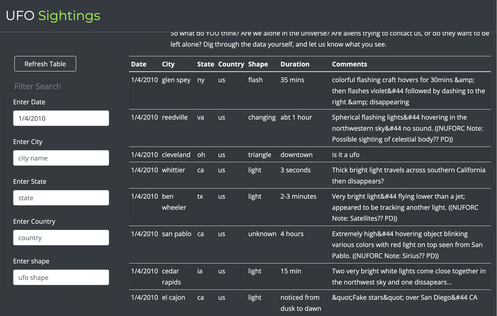
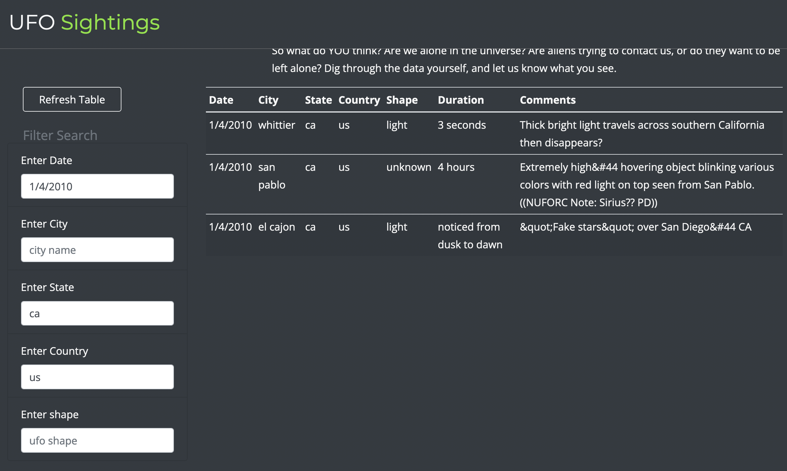

## Overview of Project: Explain the purpose of this analysis.
- The main goal of this analysis is to include multiple criteria to filter the UFO sightings table in order to allow users be able to tailer their search.

## Results: Describe to Dana how someone might use the new webpage by walking her through the process of using the search criteria. Use images of your webpage during the filtering process to support your explanation.
- Now the UFO sightings webpage allows you to filter the sightings table using sighting date, city name, state, country and even the shape of the sighting. Tha t is a hugh convince for users. 
- the screen shoots bellow show sample result of using multiple filters:
- **filtered by date**

- **filtered by state and country**

- **filtered by city name**

## Summary: In a summary statement, describe one drawback of this new design and two recommendations for further development.
